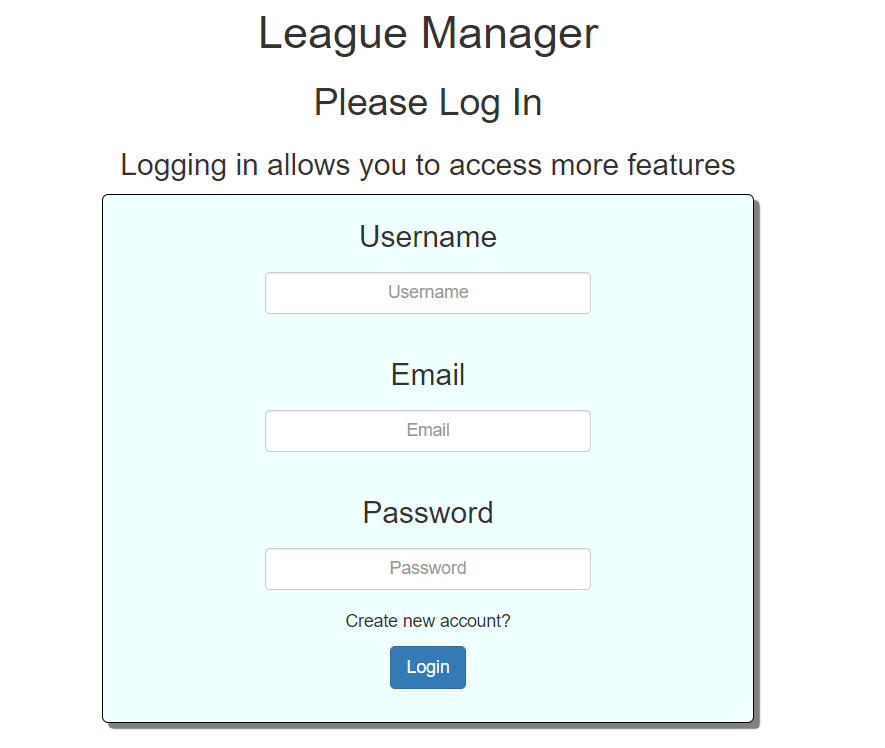

<h1>Fantasy Football League Manager</h1>
<h2>An simple Fantasy Football app.</h2>

The goal in this project is to create an app that allows a user to access all the information they would need to effectively run a Fantasy Football team or league.

The app is deployed using Heroku at 
https://ffbleaguemanager.herokuapp.com/

<h3>Release 1.0 Minimum Viable Product (MVP)</h3>

- Users are able to create an account, sign in, and view various pages displaying important Fantasy Football related information

<h3>Using the App</h3>

1. Go to https://ffbleaguemanager.herokuapp.com/

2. The user can either log in using their credentials, or create a new account For the purposes of demonstration, anyone can login in using the following crendentials.

**Username** test
**Email** test@test.com
**Password** test

3. Once logged in the user is redirected to the homepage. Currently, the page is limited, with mostly placeholder images and text. Future updates are planned to include general sports news and player injuries. Additionally, a user would be able to swap out players from this screen.
(public/images/Home)

4. When logged in, the user can view several generalized pages (in future updates, these pages could remain this way or be customized to suit a particular user's desired information).
These pages include: 
A general NFL schedule -
(public/images/nflsched.png)
Current NFL roster - 
(public/images/nflrost.png)
A mocked-up Fantasy schedule -
(public/images/matchupmock.png)
An example of what potential Fantasy teams would look like -
(public/images/sample.png)

5. Clicking log out will return the user to the login page.

<h3>MVP - How the App was developed</h3>

**Phase One - Defining MVP 1.0:** 
Since the app was created before the start of the season, MVP was defined as being able to look up very general information. Future updates would change information as the season progresses.

 Layout - The website doesn't break from simple page changes and is mobile responsive.

Login - The user should be able to create a new account with an encrypted password. This password should be stored in a way that the user can log in if they return to the page at a later time.

- Front End Functionality - The user is only able to see information if they log in.

- Back End Logic - All resquests are stored in a database. This includes the player rosters and schedules - both general and for Fantasy Football.

<h3>MVP 1.0 - What was accomplished and Future updates</h3>

All the above mentioned goals were reached, although the final product is relatively bare bones, future updates would make the website more user-oriented, rather than the database feel of the current version. 

To accomplish this future updates would include:

User ability to customize information
Easily accessible player stats and sports news
Ability to add players to an individual user's Fantasy Team.

<h3>The Team</h3>

**Amanda L. Ragone:** 

**Halon J. Hamilton:** 

**Jacob Smith:** 

**Mike Garringer:** 

**Troy Fasnacht:** 

<h3>Project Management</h3>

[Project Board - Release Version 1.0](https://github.com/rise-shine/FFBLeagueManager/projects)

